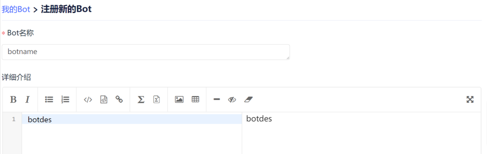

# Bot开发

Bot开发是开发者进行bot注册的重要模块。

在个人“设置”中，用户可以看到目前已经注册的bot列表，点击对应bot的“编辑”按钮可以对已注册的bot进行配置；点击“Bot注册”按钮开始注册新的bot。

在注册页中，开发者需要填写bot注册的相关信息，包括bot的名称、Webhook 地址，详细介绍等，系统将对开发者输入的信息进行合法性校验，确保bot各项信息的完整性和有效性。此外，系统将自动生成bot的唯一标识，同时调用 GitLink 平台的相关接口生成bot的身份凭证信息，包括客户端密钥和私钥等。

开发者需通过这些身份信息结合平台接口进行bot身份认证后，调用相关接口完成bot的相关功能。

平台开发API链接（待完善）：https://www.gitlink.org.cn/docs/api#introduction

