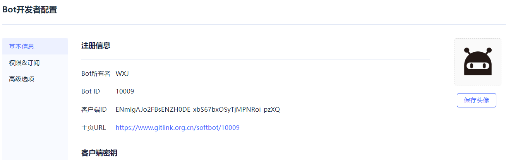
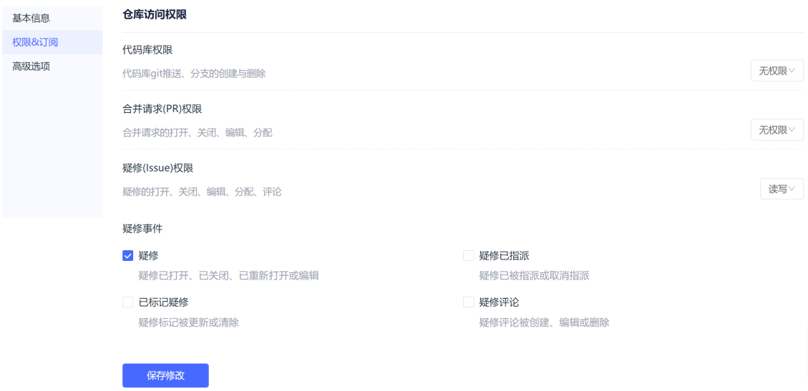

# Bot配置

Bot配置是开发者进行bot维护和配置的重要模块，主要包括bot基本信息维护、权限&订阅事件管理、高级选项配置等功能。

Bot的基本信息维护中，开发者可以看到bot的各项基本信息，并可以根据需要对bot的头像，名称，Webhook地址等进行修改。

Bot的权限&订阅事件管理中，开发者可根据对仓库资源的访问需要为bot分配不同的权限和等级，比如增加代码库权限，将拉取请求的写权限变为读权限等。开发者还能更改当前bot订阅的事件列表，比如订阅代码库推送，取消拉取请求分配订阅等，以实现bot功能的更新与升级。

Bot高级选项配置中，开发者可以改变bot的公私有状态，从而影响到bot的使用范围。需要注意的是，公开状态下的bot在已有其他仓库安装的情况下不能变成私有。开发者可选择将bot上架到市场，需要填写上架信息，包括市场简介，主要功能，次要功能等各项信息。

开发者还能进行bot的删除和转让操作，发起转让意味着更改bot的所有权，需要输入接受者的用户名。在接受者确定接受后，即可完成bot的所有权变更，拒绝则会取消本次的转让操作。

