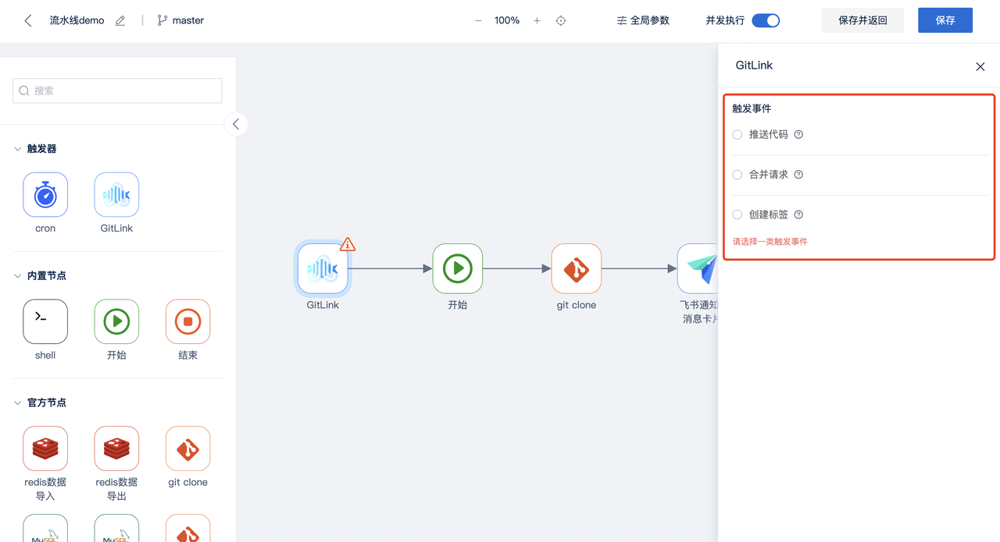
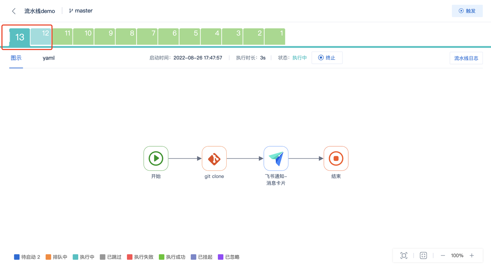

  
  # 图形流水线
  ## 基本信息
可以编辑流水线的名称、描述

同一仓库下的流水线名称不能重复

## 触发器
注：流水线编排时，触发器要放在开始节点之前；目前一条流水线仅添加支持一个触发器

* 定时触发器cron：可通过填写cron表达式设置触发的具体时间

* 事件触发器GitLink_Webhook：给出了常见的代码变更事件触发，包括推送代码、合并请求、创建标签

## 全局参数

添加后可在当前流水线中使用

使用实例

## 并发执行

开启后，同一流水线可同时并发执行n个流水线实例（每触发一次我们得到一个流水线实例）；

若未开启，则当前流水线实例执行中，后面的实例处于排队状态（最多可排队5个实例）。当前实例执行完成，下一个实例开始执行。

## 流水线编排

每条流水线必须要有一个开始节点、结束节点，至少一个任务节点。支持串行编排和并行编排。

