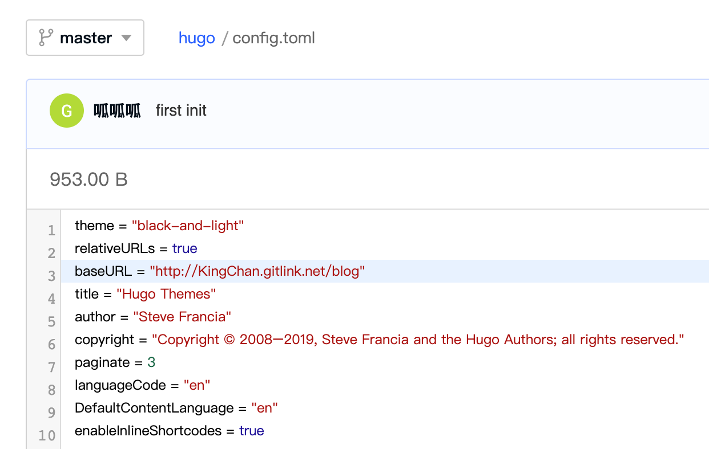
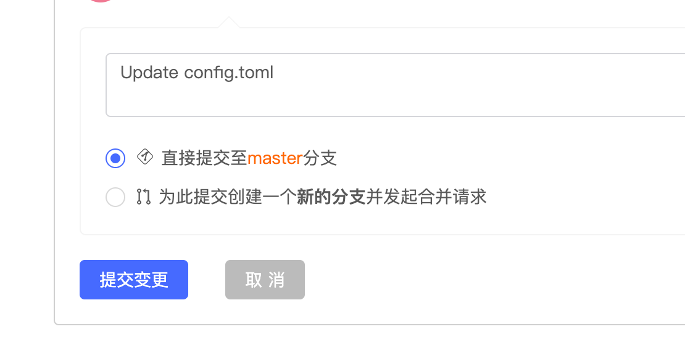
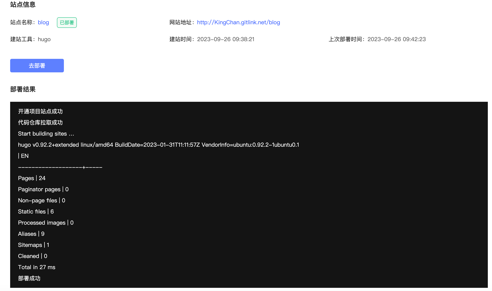
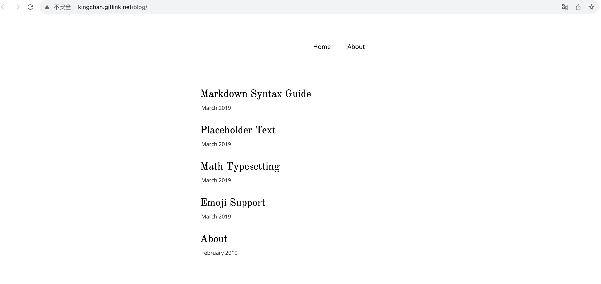
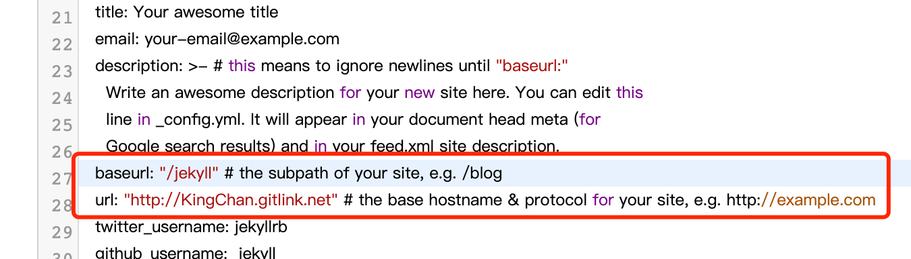
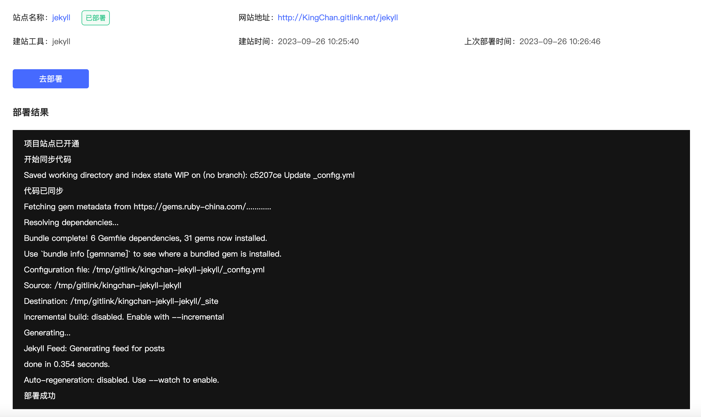
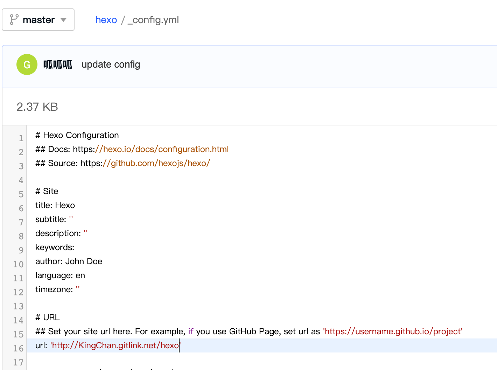
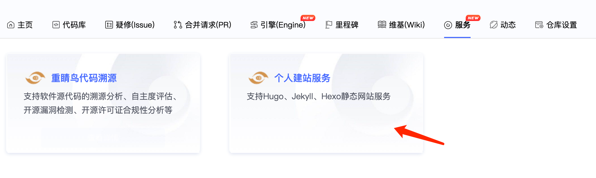
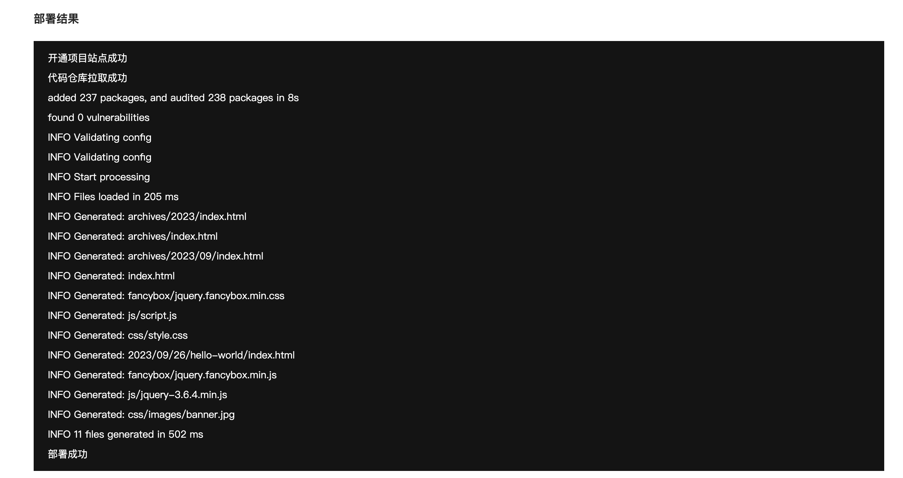
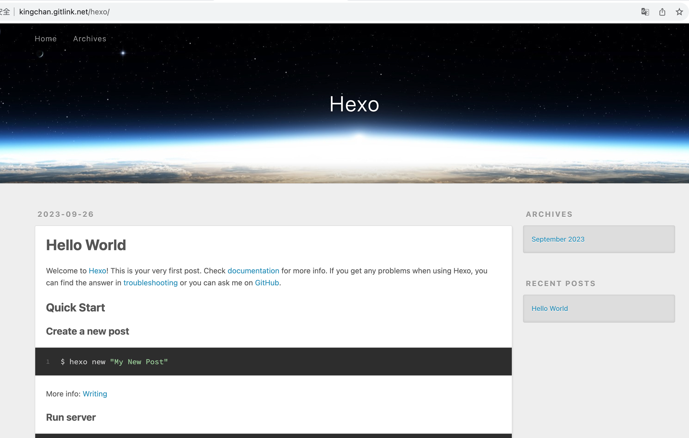

---
sidebar_label: '建站工具'      
sidebar_position: 1  

# 个人建站工具

个人主页建站是一个免费的静态网页托管服务，可用于托管静态个人主页、个人博客等静态页面。个人建站不同工具如下

### Hugo工具

使用Hugo 工具创建的仓库，需要将代码仓库中config.toml 文件中的 baseURL 修改
将值改成 个人建站服务中显示的网站地址，
例如： 现在有一个网站地址为 http://KingChan.gitlink.net/blog
那么 config.toml 中的 baseURL 应该为 http://KingChan.gitlink.net/blog
 

修改完毕后点击提交
 
提交完成后，开始部署
 
静态页面预览
  

### jekyll工具

如果是jekyll项目：
使用jekyll工具创建的个人站点，需要对代码仓库中 _config.yml文件中的 baseurl和url两个值进行修改，jekyll的配置文件比较特殊，需要根据 个人建站服务 中显示的 网站地址
内容修改两个值。
例如： 现在有一个网站地址为 http://KingChan.gitlink.net/jekyll
那么结果如下：
baseurl: "/jekyll" 
url: "http://KingChan.gitlink.net"

  

修改完成后点击 提交变更
 
提交完成后，前往建站服务开始部署
 

  

### hexo工具

如果是 hexo项目：
使用Hexo工具创建的仓库，需要将代码仓库中_config.yml 文件中的 url修改
将值改成 个人建站服务中显示的网站地址，
例如： 现在有一个网站地址为 http://KingChan.gitlink.net/hexo

那么 _config.toml 中的 url应该为 http://KingChan.gitlink.net/hexo

 

修改完毕后提交变更
 
提交完成后，前往建站服务开始部署

 

  

   

