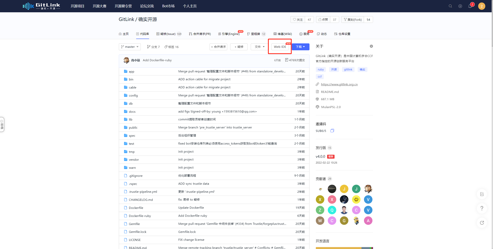

  WebIDE功能特性
1. WebIDE 入口
 
  
1. 语言服务
● 支持近 40 种语言的语法高亮
● 支持 JavaScript/TypeScript、HTML、CSS、JSON、Markdown 的基于 LSP (Language Server Protocol) 语言特性功能，具备智能提示和大纲信息以及单文件内跳转。
● 支持 Java、Go、Python、C++、Php 的基于 Tree Sitter 的在线语言服务能力，提供查看引用、符号搜索等特性

2. 分支
支持分支切换：点击左下角分支名即可切换分支。

3. 搜索
当前支持 Gitlink 仓库内代码搜索（支持单词匹配和文件过滤）和文件搜索。

4. 行高亮
支持单行或多行高亮，点击行号即可高亮行，按住 Shift 可选中连续多行。

5. Blame
支持查看单行 blame 信息，hover 后可展示详细信息。

6. Graph
支持 graph 视图，可查看分支 commits 历史以及每个 commit 详细文件变更，并支持文件 diff 查看。底部状态栏左下角点击 Git Graph 或在命令面板输入 View Git Graph，即可打开 Git Graph 视图。

7. WebSCM
可以在极速版新建分支，修改代码后在 SCM 面板看到变更文件列表，写完 commit message 后提交到 Gitlink 上。如果想快速修改一些文件可以不用在本地修改，直接通过极速版修改代码一次性提

8. 代码在线运行
● 集成了基于 skypack 的更加轻量的 CodeSwing 插件，可以在极速版去运行前端代码。
● 集成了基于  Pyodide 的 Code-Runner-For-Web 插件，可以将 Python 的运行搬到浏览器上。