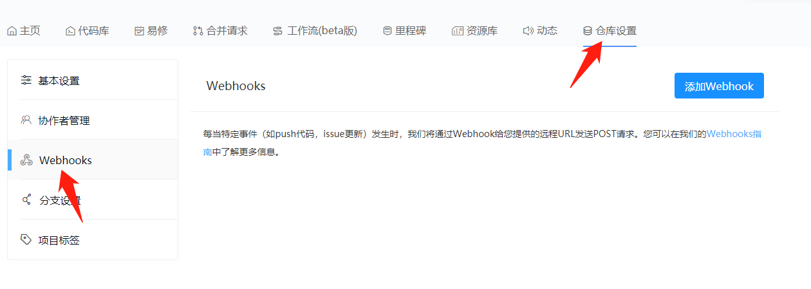
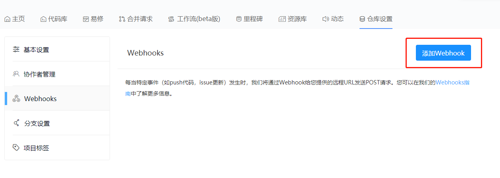
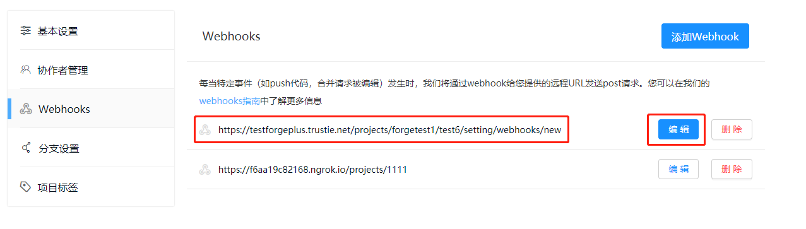

  1. Webhook模块入口
  在项目主页，点击“仓库设置”按键，再点击“网络钩子”按键，即可进入仓库的Webhook模块。  
   
    
  2. 添加Webhook
  单击“添加Webhook”按键，可进入配置Webhook页面：
 
   
   
  
  3. 编辑Webhook
  添加Webhook后，如下图所示，可以通过点击右侧”编辑“按键来对每个Webhook进行编辑操作。
  
    
    
  4. 删除Webhook
  添加Webhook后，如下图所示，可以通过点击右侧”删除“按键来对每个Webhook进行删除操作。
  
   

  5. Webhook支持的事件类型
  在GitLink中，Webhook支持的事件类型如下：
  - 推送：git推送到存储库
  - 代码库：创建或删除代码库
  - 创建：创建分支或标签
  - 删除：删除分支或标签
  - 合并请求：合并请求被打开、被关闭、被重新打开或被编辑
  - 合并请求分配：合并请求被分配或取消分配
  - 合并请求收入里程碑：合并请求被记录或取消记录于里程碑中
  - 合并请求被评论：合并请求评论被创建、编辑或删除
  - 合并请求标签：合并请求的标签被更新或清除
  - 合并请求审查：合并请求被批准、拒绝或提出审查意见，审查人员的修改，审查线程已解决或未解决
  - 合并请求被同步：合并请求被同步
  