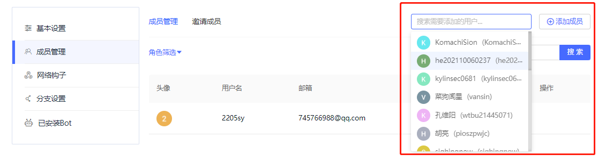
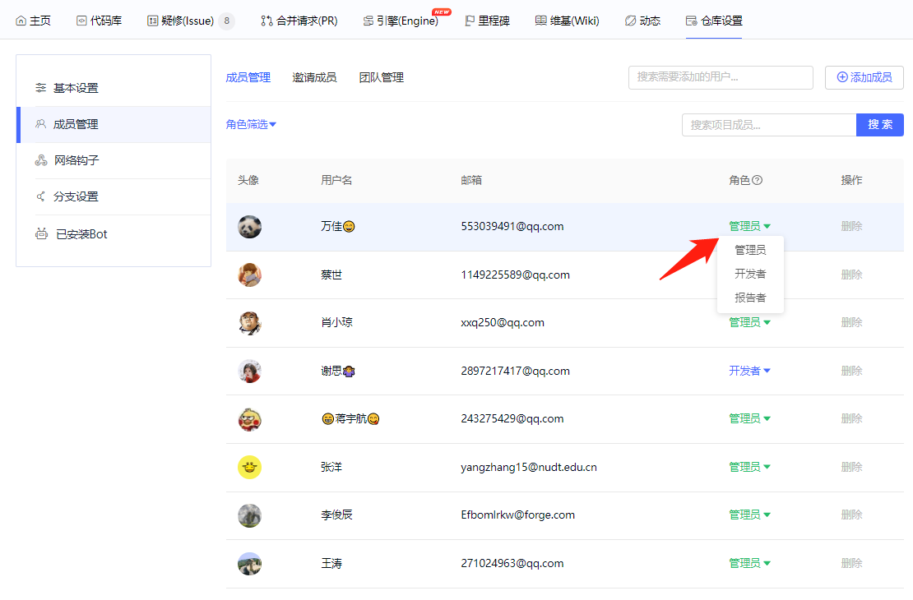

### **1. 成员管理入口**
在仓库主页，点击“仓库设置”按键，再点击”成员管理“按键，即可进入成员管理模块，如下图所示。
 
 
### **2. 筛选、搜索项目成员**
进入成员管理模块后，可以通过”角色筛选“按键来筛选项目成员类型，通过”搜索“按键可以检索具体的项目成员，如下图所示。
 
  
### **3. 筛选、搜索项目成员**
进入成员管理模块后，可以通过”添加成员“按键来添加项目成员，左侧搜索框检索到具体用户并选中后，单击”添加成员“按键即可成功添加项目成员。
 
  
### **4. 项目成员权限管理**
进入成员管理模块后，单击项目成员右侧的角色栏，可以选择赋予该名项目成员的权限等级，如下图所示。
 
  
### **5. 删除项目成员**
进入成员管理模块后，单击项目成员右侧的”删除“按键，可以删除改名项目成员，如下图所示。
 
