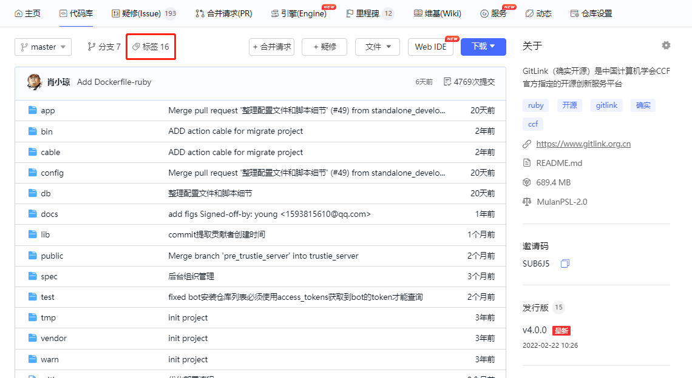
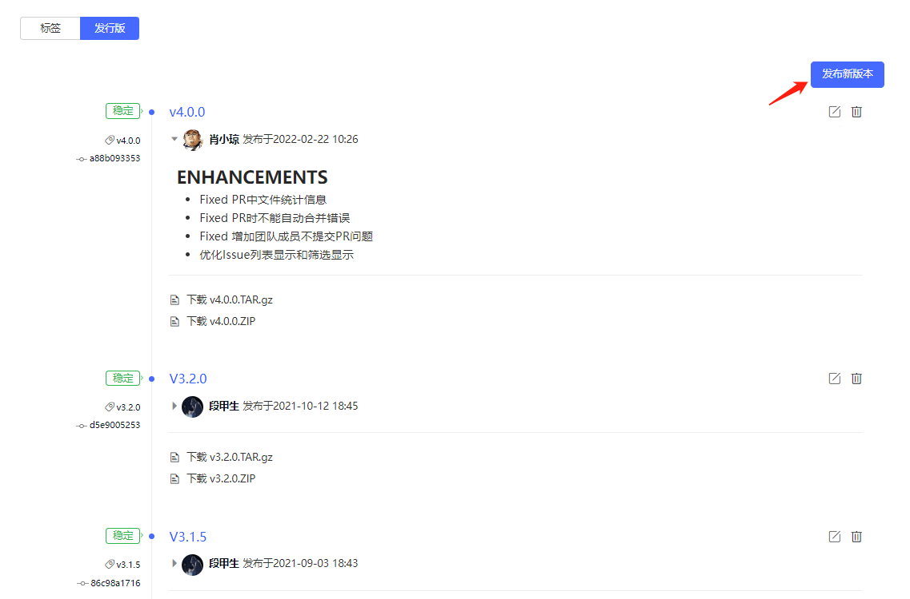
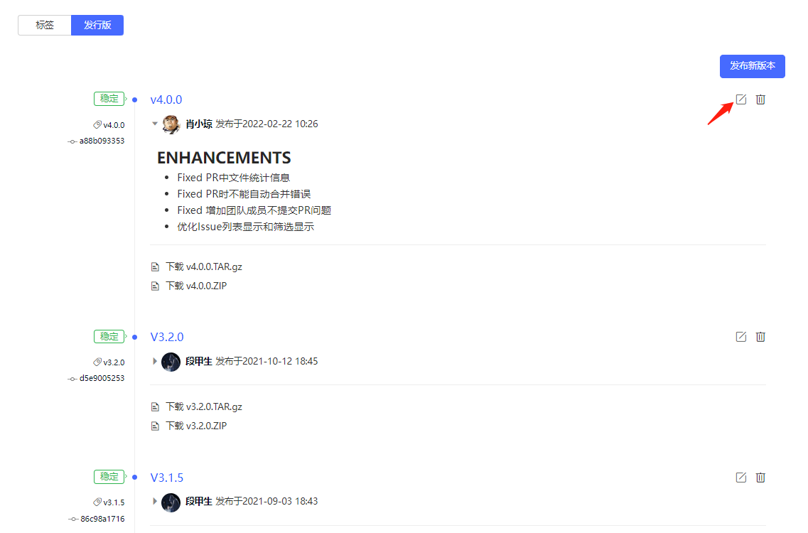
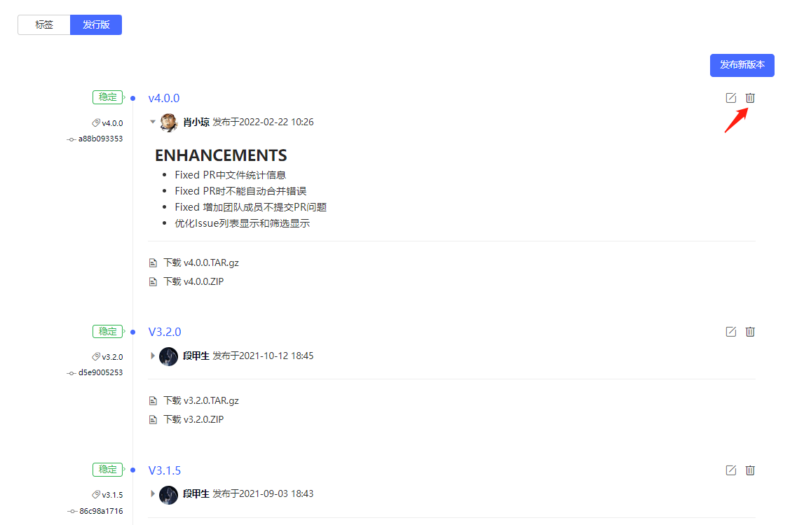

### **1. 标签和发行版管理入口**
在仓库主页，点击“代码库”按键，再点击”标签“按键，即可进入标签和发行版管理模块，如下图所示。
 
  
### **2. 删除标签**
进入标签和发行版管理模块后，点击标签右侧“删除”按键，即可实现对标签的删除操作，如下图所示。
 

### **3. 查看发行版**
进入标签和发行版管理模块后，点击”发行版”按键即可查看项目的发行版，如下图所示。
 
   
### **4. 创建发行版**
进入标签和发行版管理模块后，点击标签右侧”创建发行版”按键，即可快速创建绑定该标签的发行版，如下图所示。
 
  
### **5. 修改发行版**
进入标签和发行版管理模块后，点击发行版右侧的修改按键，即可进入发行版的修改页面，如下图所示。完成发行版的修改后，单击”保存发行版“按键即可保存修改内容。
 
 
  
### **6. 删除发行版**
进入标签和发行版管理模块后，点击发行版右侧的删除按键，即可进入发行版的删除页面，如下图所示。
 
  