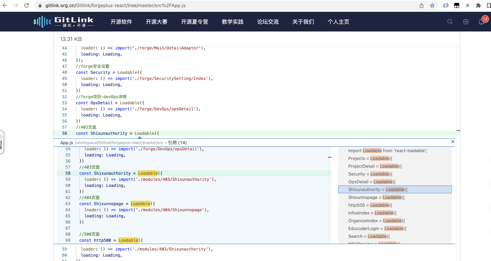
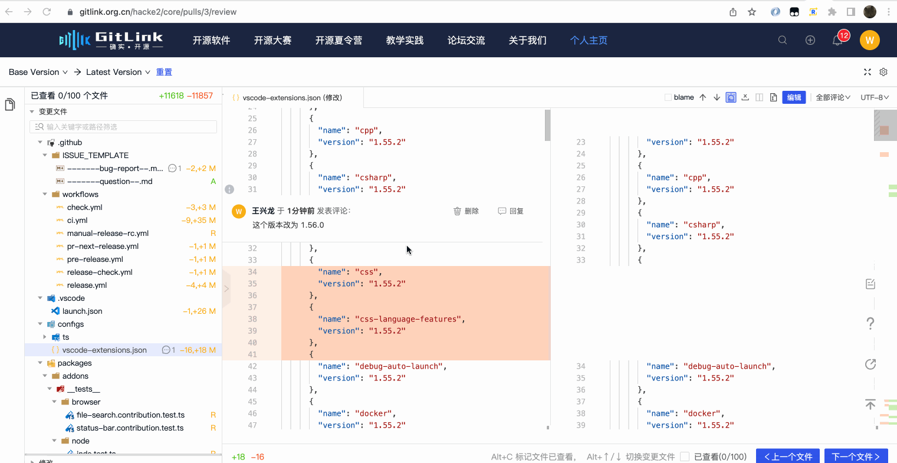
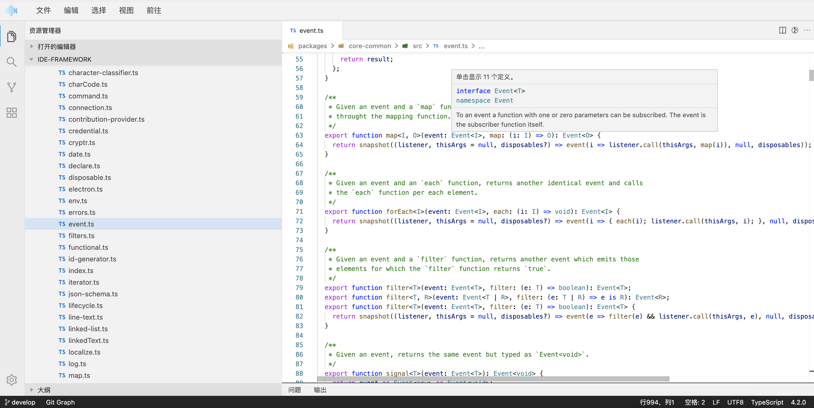
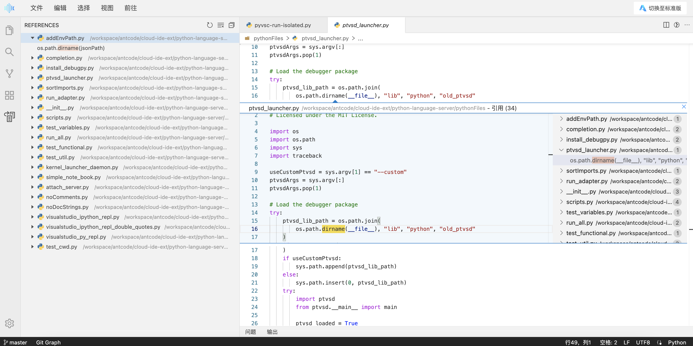
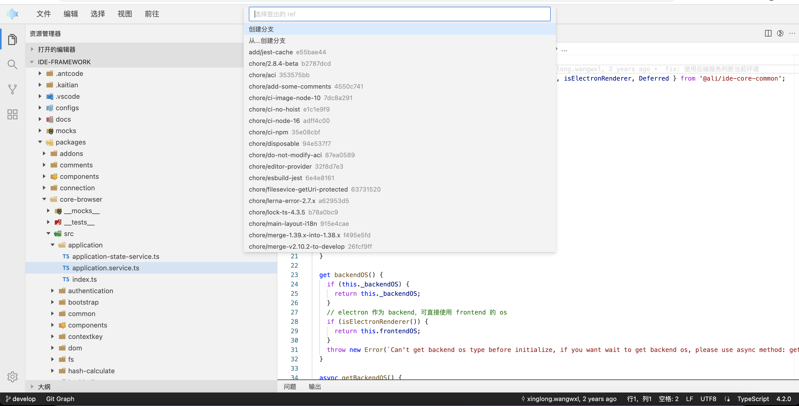
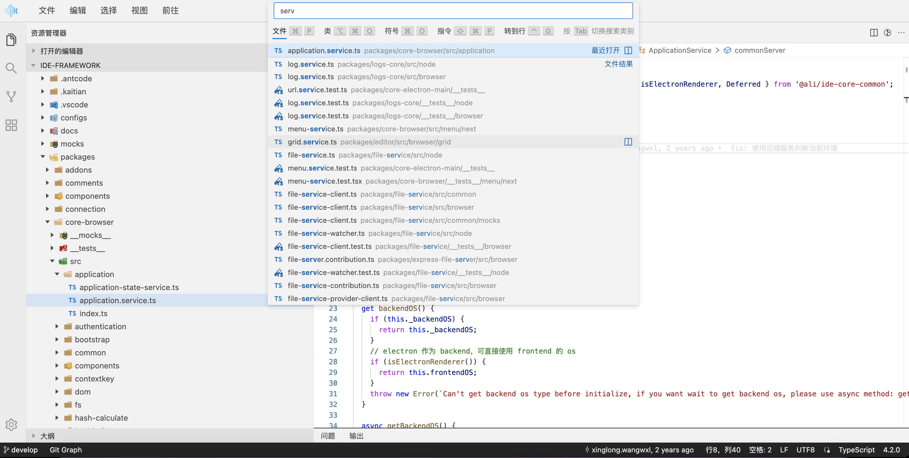
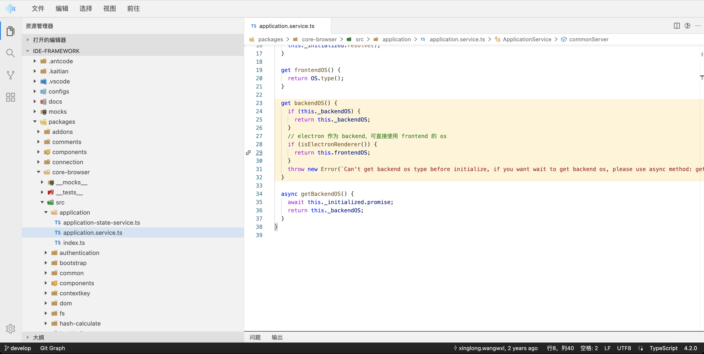
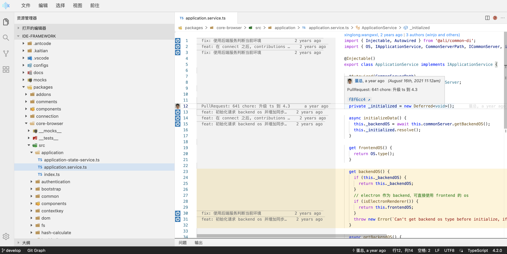
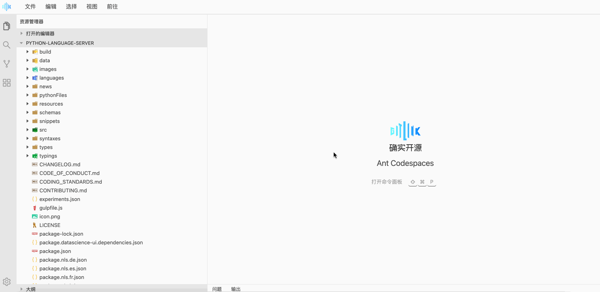
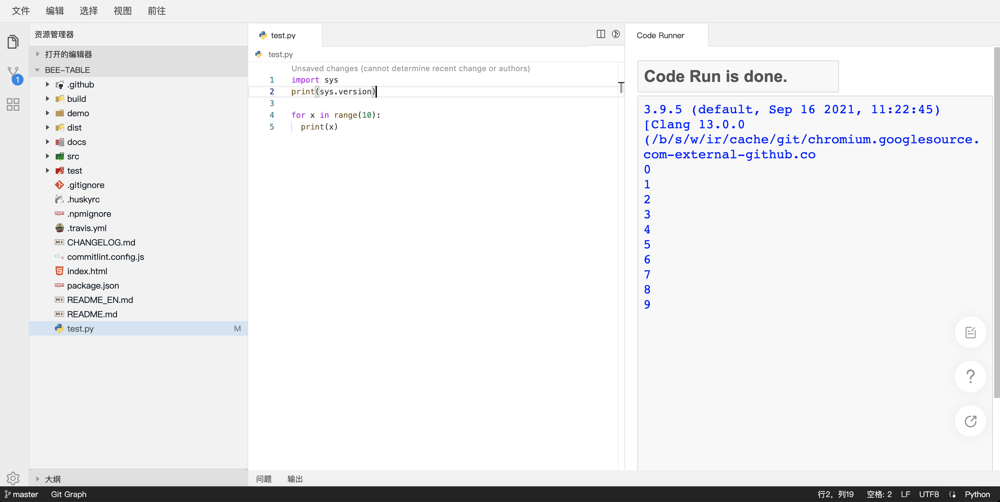

## WebIDE背景
传统的代码托管平台提供了代码仓库的 Git/SVN 的管理，可以在平台上做代码浏览、代码评审、缺陷管理、CI 流水线等和代码相关的活动。其中代码浏览、代码评审所用的编辑器组件一般为 CodeMirror，代码高亮使用 highlight.js，常常只提供了读代码的场景。蚂蚁研发效能部门云研发团队通过自研的 OpenSumi 框架及基于 OpenSumi 框架做的专门针对于 Web IDE（无远程容器）场景的极速版 Web IDE 框架，与内部代码托管平台碰撞出了创新型的、只依赖浏览器的、IDE 风格的代码阅读、代码编写、代码提交、代码运行、代码评审等场景，极大的提高了用户在代码托管平台阅读代码、代码评审、轻研发等场景的效率。本次蚂蚁研发效能云研发团队和 CCF（中国计算机学会）GitLink 代码托管平台合作，将内部极速版 Web IDE 应用到了 Gitlink 代码托管平台上，解决了长久以来的用户反馈的很多体验问题。

## Web IDE 核心能力
对标有容器的标准版，极速版 IDE 主要在读、写、运行、提交等方面进行了探索： 
 **1. 读：**  
  a. 适配了多种代码托管平台，例如 Gitlink、Github、Gitlab 等代码托管平台，业务可以非常方便的使用代码服务的能力 
  b. 内置了包括 Java、TS/JS、C++、Go、Python、Rust 等几十种常见语言的语法高亮支持 
  c. 支持了如 Git Blame、GitGraph 等代码阅读辅助插件 
 **2. 写：** 
  a. 支持 HTML/CSS/JS/Markdown 等在线语言服务能力，支持错误诊断能力 
  b. 浏览器文件系统 
 **3. 运行：** 
  a. 支持基于 Skypack 的前端代码运行方案 
  b. 支持基于 Pyodide 的 Python 运行 
 **4. 提交：** 
  a. 支持 WebSCM，提供分支切换/新增、代码提交等能力 
如果说以 CodeMirror、Monaco 为代表的浏览器 IDE 组件为 Web IDE 1.0，那拥有上述能力的极速版 Web IDE 就是 Web IDE 2.0。极速版 Web IDE 方案在蚂蚁内部与 2021 年 4 月上线，承接了代码阅读、代码评审、在线笔试、代码检查结果反馈、轻量在线研发等众多场景，同年 8 月 vscode.dev 和 github.dev 上线，与之相比，极速版 Web IDE 利用 OpenSumi 框架的高扩展性，业务可以更加深度的定制模块与插件，让业务有多的想象空间。

## 代码阅读
在代码托管平台上进行代码阅读时经常需要查看当前方法在哪里被引用、当前接口在哪里被实现，极速版 Web IDE 提供编辑器 + 插件的能力，解决了上述用户需求：
 

代码引用查看
 
Gitlink 通过实现 Blame 插件，完成了编辑器 Blame 查看的能力： 

 

当前代码行作者、修改日期查看
 

## 代码评审
代码评审功能用户长久以来一直反馈以下几个问题： 

1.语言服务缺失，阅读效率低：缺少代码高亮、提示、跳转、查看引用及大纲功能 
2.大 PR 浏览体验不佳：统计显示 Gitlink PR 平均有 14-17 个变更文件，传统代码评审交互一般为代码 Diff 组件流式展示，对于一些变更文件多、文件内部较大的场景 Review 体验不佳，常常要等待很久。 
3.代码修改流程重，耗时久：代码 Diff 组件只有读能力，无法快速修改一些拼写或 lint 错误，需要在本地找到对应文件后修改提交 针对于上述需求，蚂蚁云研发团队和 Gitlink 打造了 IDE 风格的代码评审场景： 
 

IDE模式的代码评审
 
1.变更树 a. 提供平铺和树状两种浏览方式 b. 变更树使用 OpenSumi Recycle 组件，对于大 PR 也能通过虚拟滚动高性能的查看变更文件 
2.工具栏 a. 提供 IDE 编辑器基础设置，如字体大小、编码、忽略收尾空格等 b. 快速切换当前分支历史版本与基线的对比 c. 变更文件快速定位、设置已查看，并支持快捷键快速执行 
3.编辑器 a. 通过 monaco fold 能力完成非变更内容的折叠 b. 自定义评论组件嵌入编辑器 
4.插件 a. 复用代码浏览 Blame 插件能力进行代码行 Git 信息查看 除了上述能力，Gitlink 还支持了在代码评审时快速修改代码： 

 

代码评审时可修改代码
 

## Gitlink Web IDE
Gitlink 代码阅读场景虽然接入极速版 IDE 编辑器，但文件树、代码搜索、快捷键、IDE 皮肤、等均和平时开发时使用习惯的 IDE 差异较大，更有大部分用户仅仅是为了代码阅读将代码克隆到本地，尽管保证了一致的体验，但整个链路繁琐费时。 
基于这个洞察，蚂蚁云研发团队和 Gitlink 推出 Gitlink Web IDE，可以一键快速打开 Web IDE 访问阅读项目仓库代码，实现项目与 IDE 的无缝衔接，保持研发同学的日常偏好习惯，同时完美兼容 Gitlink 代码托管平台。更重要的是，通过无容器在浏览器上直接运行一个极速版 IDE，确保「秒开」的即时体验。 

#### **1. 快速体验**
从 Gitlink 仓库首页 Web IDE 入口即可体验
 

Gitlink WebIDE 入口
 

#### **2. 代码浏览体验**
与传统 IDE 一致的代码浏览体验。文件树、皮肤样式、快捷键一应俱全。
#### **3. 语言功能**
1.支持近 40 种语言的语法高亮 
2.支持 JavaScript/TypeScript、HTML、CSS、JSON、Markdown 的基于 LSP (Language Server Protocol) 语言特性功能，具备智能提示和大纲信息以及单文件内跳转。 
 

JS语言服务提示
 
3. 提供了 Java、Go、Python、C++、Php 的在线语言服务能力，支持简单的定义跳转、查找引用等功能，让大家更加方便的阅读代码 

 

Python 查看引用
 

#### **4. 分支新建与切换**
点击左下角分支名即可新建/切换分支。 

 

分支新建与切换
 

#### **5. 文件搜索**
使用 CMD/Ctrl + P 唤起文件搜索面板 

 

文件搜索面板
 

#### **6. 行高亮**
持单行或多行高亮，点击行号即可高亮行，按住 Shift 可选中连续多行。 
 

多选行高亮
 

#### **7. Blame**
支持查看单行 blame 信息，hover 后可展示详细信息。 
 

Blame详细信息
 

#### **8. Graph**
支持 graph 视图，可查看分支 commits 历史以及每个 commit 详细文件变更，并支持文件 diff 查看。底部状态栏左下角点击 Git Graph 或在命令面板输入 View Git Graph，即可打开 Git Graph 视图。 
 

Graph 详细信息
 

#### **9.WebSCM**
对于开发来说日常多个需求并行开发是非常常见的事，经常修改一些很小但必要的逻辑，而也许你本地环境已经在开发下一个需求，频繁的分支切换并行修改又容易出错。通过 Gitlink Web IDE 极速切换分支修改提交一气呵成，无需打断本地开发流程。 
 

WebSCM
 

#### **10.代码在线运行**
目前如果在没有容器的情况下，大部分应用只能运行前端代码。Gitlink Web IDE 集成了基于 skypack 的更加轻量的 CodeSwing 插件，可以在极速版去运行前端代码，并且代码版本是使用 Gitlink 来管理。结合上述 WebSCM 能力，甚至能在一分钟完成前端代码初始化、编写、预览和代码提交。 
 

前端代码运行
 

随着 Webassembly 技术的发展，一些后端语言也可以运行在浏览器里，在 2021 年 Google IO 大会上，StackBlitz 展示了他们最近做的技术：WebContainer，该能力可以将语言运行时编译为 Webassembly 从而运行在浏览器上。Code-Runner-For-Web 插件结合 Pyodide，已经将 Python 的运行搬到了浏览器上，新版极速版也默认集成了该插件。 
 

Python代码运行
 