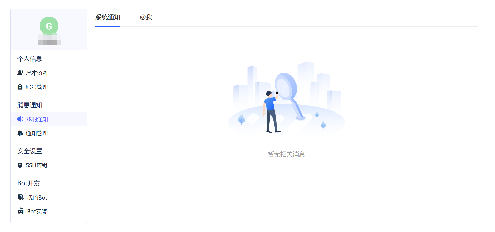

# 确实开源帮助中心

## 通知简介
#### 1.通知类型
GitLink将通知分为“系统通知”和“@我”的两种类型：
* 系统通知包括“我的状态”、“我创建的或负责的”、“我管理的仓库”三种类型的通知:

| 系统通知类型 | 具体通知内容 |
| ----------- | ----------- |
| 我的状态 | 账号有权限变更；被拉入或移出组织；被拉入或移出项目；有新的疑修指派给我；有新的合并请求指派给我；|
| 我创建的或负责的 | 疑修状态变更；合并请求状态变更；|
| 我管理的仓库 | 有新的疑修；有新的合并请求；有成员变动；仓库设置被更改；|
* “@我”的通知目前支持在用户首页、课程首页、项目首页的动态列表中使用@功能对用户进行通知

#### 2.查看通知
登录后在平台右上角个人头像旁即可查看收到的通知数量，移动光标至通知按钮出现下拉列表可以分别查看“系统通知”和“@我”的通知

 

点击通知按钮可以进入消息通知管理界面
